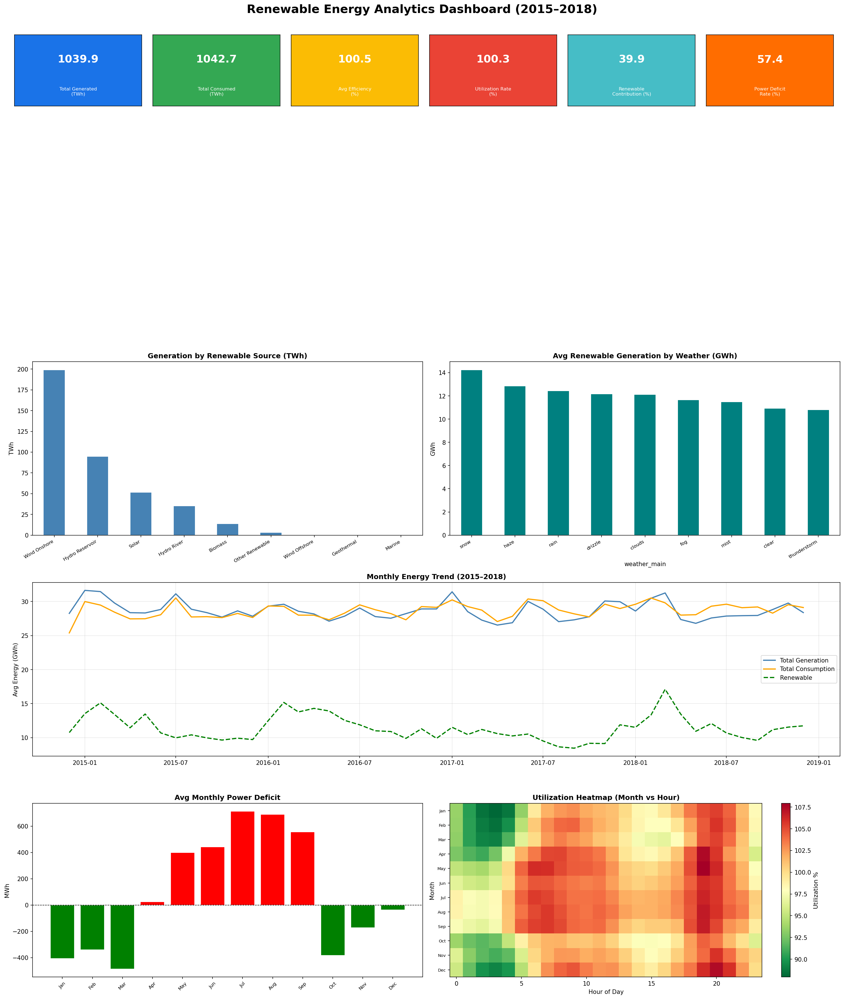

# Renewable-Energy-Dashboard
Renewable Energy Analytics Dashboard using Python - AI &amp; ML Internship Task 15
# Task 15 - Renewable Energy Analytics Dashboard

## 1. Problem Statement
Renewable energy generation is highly dynamic and depends on weather, season, and infrastructure. This project builds an analytics dashboard to monitor energy production, identify inefficiencies, and improve sustainability strategies.

## 2. Dataset Description
- **energy_dataset.csv** — Hourly energy generation by source (solar, wind, hydro, biomass, fossil fuels), load forecast, actual load, and price data (2015–2018, Spain)
- **weather_features.csv** — Hourly weather data (temperature, humidity, wind speed, cloud cover, rain) for 5 Spanish cities

## 3. KPI Definitions
| KPI | Definition |
|-----|-----------|
| Total Energy Generated | Sum of all generation sources (MWh) |
| Total Energy Consumed | Sum of actual load (MWh) |
| Avg Plant Efficiency | Mean utilization rate across all hours (%) |
| Utilization Rate | (Total Consumed / Total Generated) × 100 |
| Renewable Contribution % | (Total Renewable / Total Generated) × 100 |
| Power Deficit Rate % | % of hours where demand exceeded supply |
| Active Hours Monitored | Total hourly records analyzed |
| Utilization by Weather | Avg utilization rate grouped by weather condition |

## 4. Dashboard Screenshots

## 5. Key Findings
- **Wind Onshore** is the dominant renewable source — 199.1 TWh (2015–2018)
- **Renewable contribution** averages 39.9% of total generation
- **Power deficit** occurs in 57.4% of hours — demand frequently exceeds supply
- **Summer months (May–Sep)** show highest power deficit — peak cooling demand
- **Snow and haze** weather conditions yield highest renewable generation (wind driven)
- **Evening hours (19–20hr)** show peak utilization stress across all months
- **Winter months** show energy surplus — strong wind generation

## 6. Recommendations
1. **Expand wind onshore capacity** — highest contributing renewable source
2. **Add energy storage systems** — to bridge summer deficit gaps
3. **Boost solar capacity** — currently underutilized vs wind potential
4. **Demand-side management** — reduce evening peak load (19–20hr)
5. **Seasonal planning** — prepare surplus storage in winter for summer demand

## 7. Future Scope
- Integrate real-time data feeds for live dashboard monitoring
- Add region-wise breakdown using all 5 city weather datasets
- Build predictive models for energy demand forecasting
- Deploy as interactive web dashboard using Streamlit or Power BI

## Tools Used
- Python (Pandas, NumPy, Matplotlib)
- Jupyter Notebook
- Dataset: Spain Energy & Weather Dataset (Kaggle)
